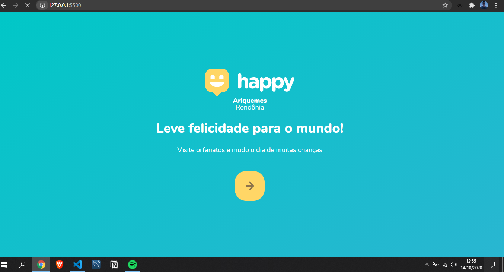
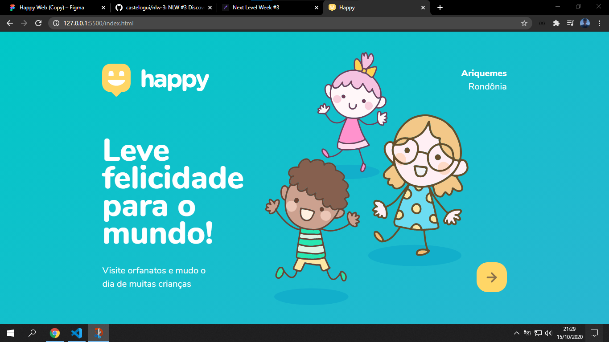
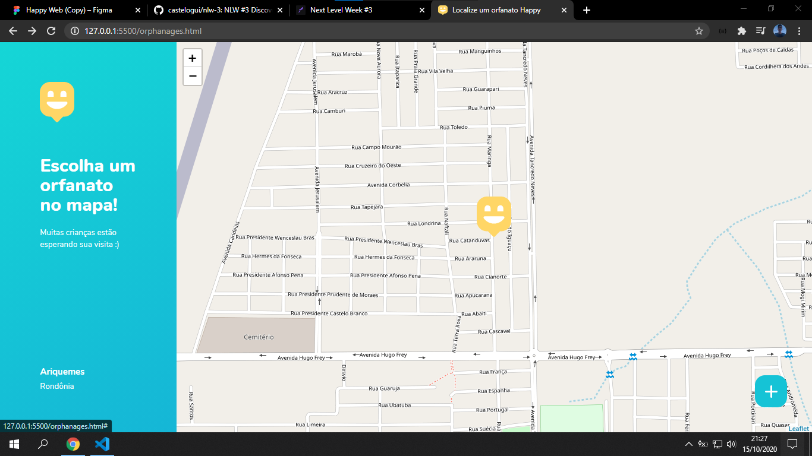
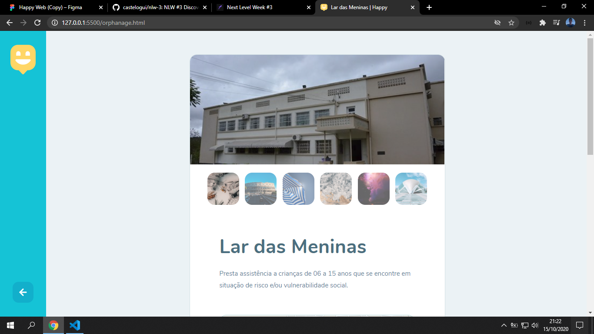
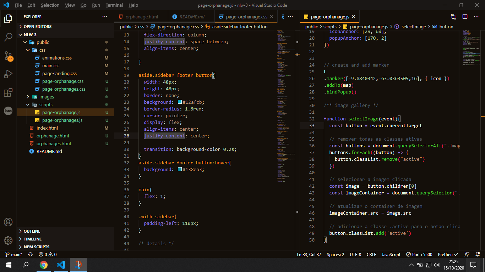

# nlw-3

### 📜 NLW #3 | Trilha Discovery 
Uma semana intensa de muito aprendizado e foco construindo um sisteminha utilizando **html**, **css** e **java-script**.

[![NPM Version][npm-image]][npm-url]
[![Build Status][travis-image]][travis-url]
[![Downloads Stats][npm-downloads]][npm-url]

💡 O [Happy](https://castelogui.github.io/nlw-3/) é uma ideia criada pela equipe da rocketseat na semana do **dia das crianças**. A ideia principal e desenvolver um sistema que seje possível cadastrar orfanatos de várias localidades. Dessa maneira, será possível que as comunidades conheçam os orfanatos de sua região. Com isso poderia ser realizadas visitas nos orfanatos cadastrados, com intíuido de fazer uma criança mais feliz, tendo em vista que as orfãs não recebem muitas visitas, talvez nenhuma. 

Uma ideia bastante colaborativa que se implementada corretamento pode dar muito certo e ajudar muitos orfanatos e muitas crianças a terem uma nova visão de suas vidas.


## 🗃 Desenvolvimento

- [x] **Day #1**
  > - Desenvolvimento inicial da Landing Page do projeto
  > - Conceitos básicos sobre HTML e CSS 
  

- [x] **Day #2**
  > - Finalização da Landing Page do Happy
        - adição de animações
        - imagem
  
  > - Desenvolvimento da página de localização dos orfanados
        - adição do mapa
        - adição de animações
  
  > - Criação da página de um específico orfanato
        - Adição de uma galeria de imagens aleatórias
  
  
  > - Introdução maior ao javascript
        - funções
        - variaveis e constantes
        - laços de repetições
     

  
- [ ] **Day #3**

- [ ] **Day #4**
  
- [ ] **Day #5**
  

<!-- 
## 📈 Exemplo de uso

Alguns exemplos interessantes e úteis sobre como seu projeto pode ser utilizado. Adicione blocos de códigos e, se necessário, screenshots.

_Para mais exemplos, consulte a [Wiki][wiki]._ 

## 💻 Configuração para Desenvolvimento

Descreva como instalar todas as dependências para desenvolvimento e como rodar um test-suite automatizado de algum tipo. Se necessário, faça isso para múltiplas plataformas.

```sh
make install
npm test
```
-->
## 🗃 Histórico de lançamentos

<!--  
* 0.2.1
    * MUDANÇA: Atualização de docs (código do módulo permanece inalterado)
* 0.2.0
    * MUDANÇA: Remove `setDefaultXYZ()`
    * ADD: Adiciona `init()`
* 0.1.1
    * CONSERTADO: Crash quando chama `baz()` (Obrigado @NomeDoContribuidorGeneroso!)
* 0.1.0
    * O primeiro lançamento adequado
    * MUDANÇA: Renomeia `foo()` para `bar()`
-->
* 0.0.1
    * Trabalho em andamento durante a semana do **Next Level Week #3**

## 📋 Meta

Guilherme Castelo – [@castelogui](https://twitter.com/...) – guilhermecastelo.mail@gmail.com

Distribuído sob a licença XYZ. Veja `LICENSE` para mais informações.

[Happy](https://castelogui.github.io/nlw-3/)

## 🚀 Contributing

1. Faça o _fork_ do projeto (<https://github.com/castelogui/nlw-3/fork>)
2. Crie uma _branch_ para sua modificação (`git checkout -b feature/fooBar`)
3. Faça o _commit_ (`git commit -am 'Add some fooBar'`)
4. _Push_ (`git push origin feature/fooBar`)
5. Crie um novo _Pull Request_

[npm-image]: https://img.shields.io/npm/v/datadog-metrics.svg?style=flat-square
[npm-url]: https://npmjs.org/package/datadog-metrics
[npm-downloads]: https://img.shields.io/npm/dm/datadog-metrics.svg?style=flat-square
[travis-image]: https://img.shields.io/travis/dbader/node-datadog-metrics/master.svg?style=flat-square
[travis-url]: https://travis-ci.org/dbader/node-datadog-metrics
[wiki]: https://github.com/castelogui/nlw-3/wiki
